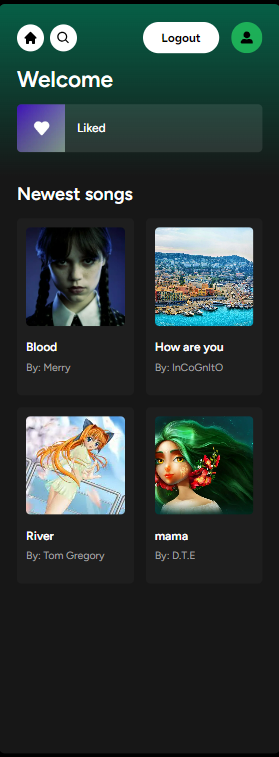
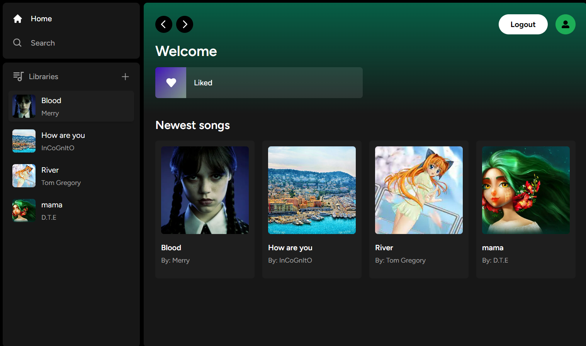
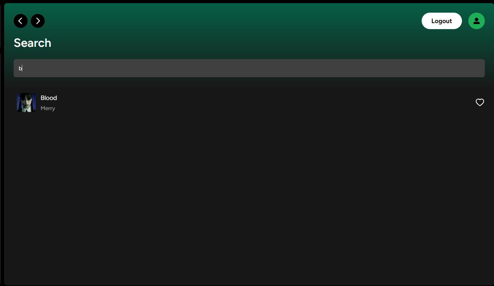
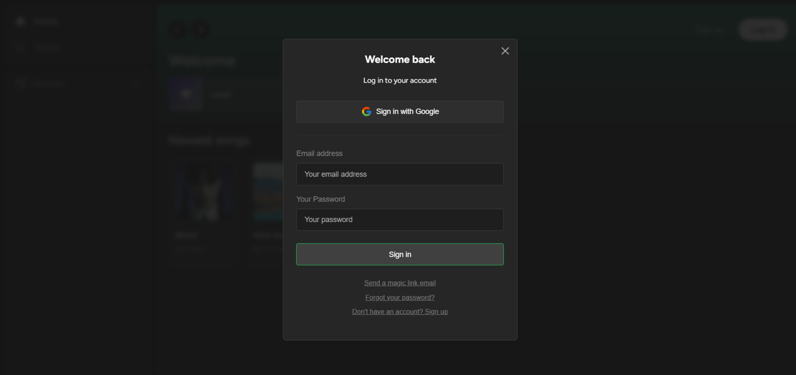
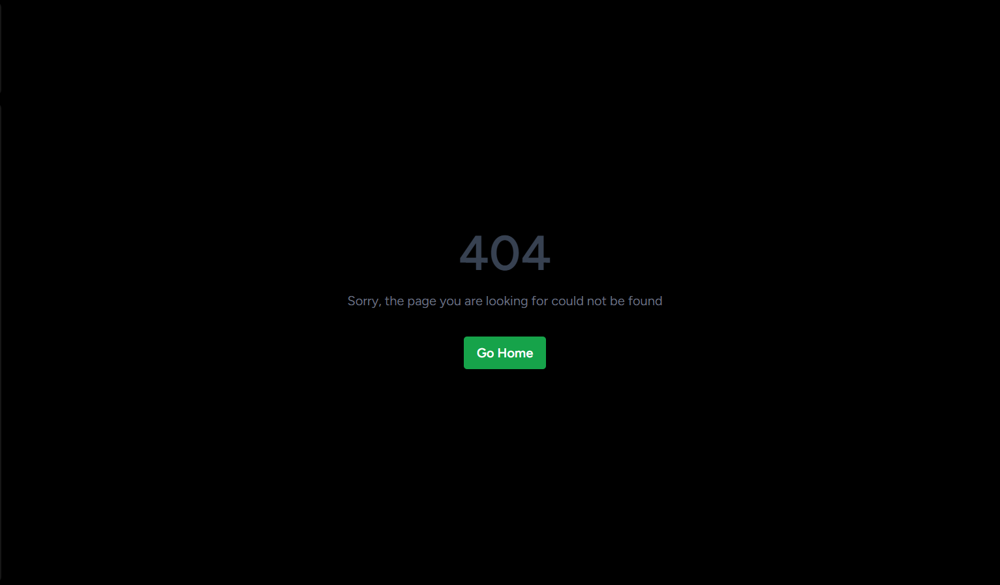

# Spotify Clone with Next.js, React, Tailwind, Supabase, PostgreSQL, Stripe

This project is my attempt to create a new platform for music streaming. Of course, it has its advantages and disadvantages. The stack of technologies mentioned above is new to me, so the platform has limited functionality, but it has brought me a new experience during development. And here's what came out as a result.

## Key Features:

- Song upload
- Stripe integration
- Tailwind design for sleek UI
- Tailwind animations and transition effects
- Full responsiveness for all devices
- Credential authentication with Supabase
- Google authentication integration
- File and image upload using Supabase storage
- Client form validation and handling using react-hook-form
- Server error handling with react-toast
- Play song audio
- Favorites system
- Playlists / Liked songs system
- Stripe recurring payment integration
- Handling relations between Server and Child components in a real-time environment
- Cancelling Stripe subscriptions

## Design:

## 

## 

## 

## 

## 